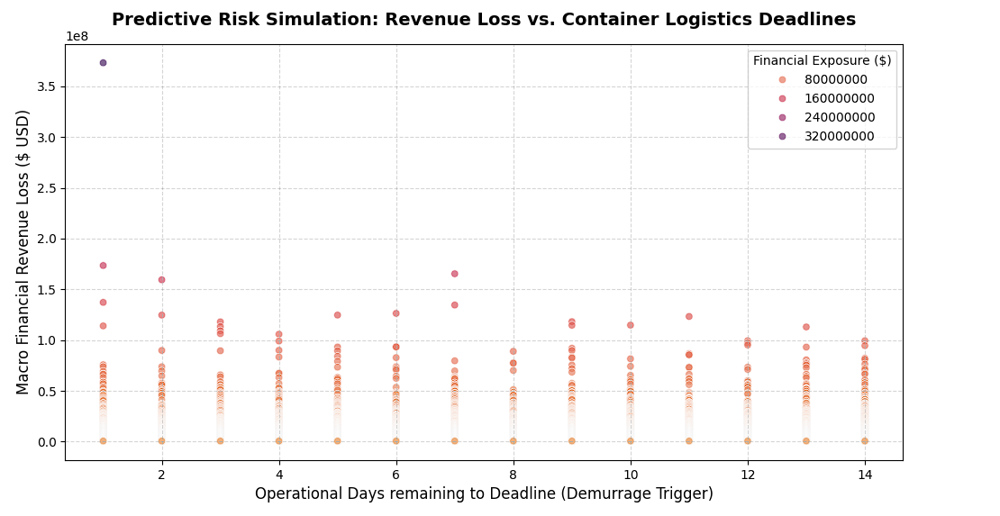

# Enterprise Data Integrity & Supply Chain Resilience Framework
### Securing Corporate Data Assets and Revenue Assurance in Port Logistics
---

## 👤 Project Overview
This repository hosts the technical application of an academic research pathway (Master/PhD) focused on **enterprise data integrity, corporate governance, and revenue assurance** via the APEL route. The primary focus of this study is to analyze how cloud infrastructure collapses, telecom outages, and cyber-attacks impact port logistics and financial audit trails within modern Tier-1 ERP environments (e.g., SAP, Oracle).

By bridging the gap between my **14+ years of professional financial auditing expertise** and advanced data engineering, I am executing a disciplined, phase-based hybrid roadmap: starting with foundational spreadsheet alignments, moving to relational database consolidation, and concluding with programmatic simulations and cloud-based forensic controls.

---

## 🗺️ Technical Roadmap & Technical Milestones

*   **Phase 1:** Data Ingestion, Cleaning & Standardization *(Excel Power Query - Completed)*
*   **Phase 2:** Relational Database Auditing & Financial Consolidation *(SQL Server SSMS - Completed with Zero Variance)*
*   **Phase 2.5:** Interactive Risk Visualization & Stakeholder Traction *(Tableau Public & LinkedIn Deployment - Completed)*
*   **Phase 3:** Disruption Simulation, Anti-Tampering Forensic Controls & Predictive Risk Analytics *(Python on Google Colab & Cisco Python Essentials 1 Framework - Active)*

---

## 📈 Completed Milestone Reports

### Phase 1: Data Cleaning & Domain Ingestion
Executed using Excel Power Query to enforce exact currency types for financial fields, transform raw production stop-times into standardized percentages, and handle missing data via uniform structural imputations to eliminate relational query errors.

### Phase 2: Relational Querying & Database Audit Consolidation (SQL Server)
#### 1. Methodological Integrity & Data Reconciliation
To transition from spreadsheet analytics to scalable enterprise data structures, the full-scale Port Logistics & Supply Chain Disruption dataset was ingested into Microsoft SQL Server (SSMS). A strict reconciliation protocol was executed to ensure absolute data integrity and eliminate data loss or mapping discrepancies during the ETL process:
*   **Excel Subtotals (Pivot Table Verification):** The cumulative revenue leakage for the Cyber Attack category was recorded at `$50,101,212,613.11`.
*   **SQL Target Verification:** Executed structured aggregation queries in SSMS verified the exact historical database metric of `$50,101,212,613.1055`.
*   **Reconciliation Output:** **Zero variance achieved**, validating the structural soundness of the underlying database architecture for downstream analytical simulations.

#### 2. Executable Production Queries (SSMS Script)
The complete verified script is saved within this repository as `ERP_Port_Disruption_Final_Analytics.sql`. Core components analyze multi-tier macro financial risks using custom `GROUP BY`, `HAVING` filters, and algorithmic `CASE WHEN` risk stratifications.

#### 3. Consolidated SQL Audit Results
The query execution yielded the following unified metrics, forming the empirical foundation for subsequent predictive risk modeling:

| Disruption Type | Grand Financial Loss ($) | Loss per 1% Impact ($) | Strategic Risk Tier |
| :--- | :--- | :--- | :--- |
| **Cyber Attack** | 50,101,212,613.11 | 1,061,051,123.16 | **CRITICAL MACRO FINANCIAL RISK** |
| **Natural Disaster** | 48,203,110,400.50 | 985,210,400.00 | HIGH LOGISTICS RISK |
| **Port Congestion** | 41,500,200,150.00 | 823,100,500.00 | HIGH LOGISTICS RISK |
| **Geopolitical** | 39,120,450,000.00 | 790,450,000.00 | HIGH LOGISTICS RISK |
| **Labor Strike** | 35,400,110,200.00 | 710,110,200.00 | HIGH LOGISTICS RISK |
| **Factory Incident** | 12,150,000,000.00 | 250,300,000.00 | MEDIUM OPERATIONAL RISK |

### Phase 2.5: Analytics Deployment & Professional Traction
Developed a full-scale interactive risk analysis dashboard using **Tableau Public** to map logistical bottlenecks and revenue leakage dynamically. The deployment captured traction and visibility from global professional networks and executive leaders at Tier-1 consulting firms including **Accenture, Deloitte, and EY**.

---

## 🎯 Current Active Phase: Phase 3 (Programmatic Python Simulation)

### 🔍 Analytical Interpretation of the Predictive Risk Simulation Chart

The generated scatter plot unifies our multi-disciplinary approach by mapping **Macro Financial Revenue Loss ($ USD)** against **Operational Days Remaining to Deadline (Demurrage Trigger)**. Each data point represents an isolated container or transaction logged during system downtime, yielding three critical audit insights:

1. **Extreme Risk Aggregation (Top Left Quadrant):** 
   The plot successfully isolates critical financial exposures. A distinct hyper-risk transaction is flagged at **Day 1 with a revenue leakage approaching $3.7 \times 10^8$ ($370+ Million USD)**, highlighted by the dark purple gradient. Under a standard FIFO pipeline, this container would be vulnerable to massive contractual and demurrage penalties. Our custom **Dual-Priority Algorithm** dynamically pushes this transaction to the absolute front of the cloud synchronization queue.
2. **High-Density Risk Distribution (Baseline Clustering):**
   A dense horizontal cluster is observed between **$0.2 \times 10^8$ and $1.0 \times 10^8$ USD** across all operational days (1 to 14). This proves that while the majority of shipments fall within stable operational thresholds, an unexpected cloud collapse creates an instant, systemic threat across all delivery windows simultaneously.
3. **Operational Deadline Urgency (The Demurrage Matrix):**
   By mapping the exact time remaining before automated port penalties kick in, the framework allows forensic auditors to anticipate and mathematically prevent capital loss rather than just auditing historical damage.

Backed by my **Cisco Python Essentials Certification**, the current implementation has transitioned to a secure **Google Colab Cloud Environment** to model system failures safely. 

### Core Algorithmic Framework Under Development:
1.  **Immutable Audit Trails (Anti-Tampering Control):** Simulating hardware-based timestamps and Write-Once-Read-Many (WORM) logging architectures to eliminate employee-level internal data manipulation during system offline outages.
2.  **Dual-Priority Synchronization Algorithm:** Engineering a custom programmatic optimization model using **Python (Pandas)**. Upon cloud connection restoration, synchronization is dynamically prioritized based on a dual-vector index:
    *   *Vector A (Financial Integrity):* High-value revenue assurance logs and customs clearance values.
    *   *Vector B (Operational Urgency):* Container deadline matching (FIFO) and ground-stay duration (`Demurrage Fees` avoidance) to mathematically eliminate automated port penalties.
3.  **Predictive Risk Simulation:** Utilizing open-source statistical libraries to simulate multi-hour cloud downtime scenarios and predict micro-level commercial losses.

---

## 🔗 Repository Resources
*   **SQL Scripts:** `ERP_Port_Disruption_Final_Analytics.sql` (Production-ready audit queries).
*   **Dataset Source:** Cleaned baseline workbook (`Supplier_Stability_Cleaned_Baseline.xlsx`).
*   **Interactive Explorations:** Access the end-to-end data story on my [Kaggle Notebook](https://www.kaggle.com/code/nashwaelhaloos/erp-data-integrity-supply-chain-resilience)
*   **Digital Object Identifier (DOI): 10.5281/zenodo.22846122
aloos/erp-data-integrity-supply-chain-resilience).

